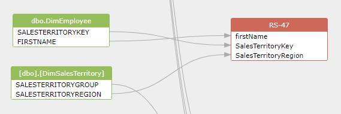

## Discover data lineage in a SQL script file with the metadata from the SQL Server database

Let's say we like to get data linage from this sample SQL:

```SQL
use AdventureWorksDW2019

SELECT e.firstName, e.SalesTerritoryKey, SalesTerritoryRegion
FROM dbo.DimEmployee e
left join dbo.DimSalesTerritory d
on e.SalesTerritoryKey = d.SalesTerritoryKey
```

As you can see, due to the lack of metadata information, 
column `SalesTerritoryRegion` is treated as a column of table: `dbo.DimEmployee`, which is not correct.
This kind of error is due to the lack of the metadata from the database.


This is the data lineage with support of the metadata from the database.


Here is the schema information from the database, `dbo.DimSalesTerritory` includes the column `SalesTerritoryRegion`


In order to resolve ambiguous column problem, grabit tool will connect to the database to grab the metadata and 
then resolve this problem.

Here is the configuration used by the grabit tool:
```json
{
	"databaseType":"sqlserver",
	"optionType":4,
	"resultType":1,
	"SQLInSingleFile":{
	    "filePath":"/home/ubuntu/demo.sql"
	},
	"enableGetMetadataInJSONFromDatabase":1,


	"databaseServer":{
		"hostname":"115.159.225.38",
		"port":"1433",
		"username":"sa",
		"password":"your password here",
		"sid":"",
		"extractSchema":"",
		"excludedSchema":"",
		"extractedDbsSchemas":"AdventureWorksDW2019/dbo",
        "excludedDbsSchemas":"master/dbo,master/sys,master/INFORMAITON_SCHEMA,msdb/dbo,tempdb/dbo,tempdb/sys,model/dbo",
        "extractedStoredProcedures":"",
        "extractedViews":"",
		"enableQueryHistory":false,
		"queryHistoryBlockOfTimeInMinutes":30
	},
	"SQLFlowServer":{
		"server":"http://server.sqlflow.cn",
		"serverPort":"8081",
		"userId":"gudu|0123456789",
		"userSecret":""
	},
	"neo4jConnection":{
	    "url":"",
        "username":"",
        "password":""
	},
	"isUploadNeo4j":0
}
```


