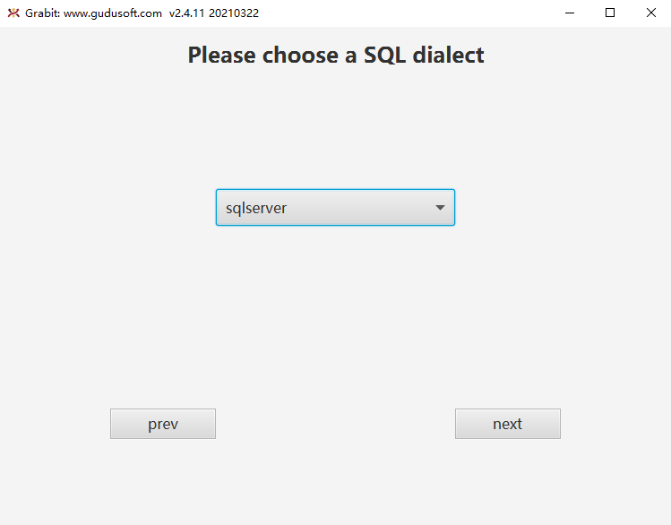

## Automated data lineage from SQL Server
This article introduces how to discover the data lineage from SQL Server scripts or 
from the SQL Server database and keep it updated automatically. 
So the business users and developers can see the SQL Server data lineage graph instantly.

### Software used in this solution
- [SQLFlow Cloud](https://sqlflow.gudusoft.com) Or [SQLFlow on-premise version](https://www.gudusoft.com/sqlflow-on-premise-version/)
- [Grabit tool](https://www.gudusoft.com/grabit/) for SQLFlow. It's free.


### Install grabit tool
After [download grabit tool](https://www.gudusoft.com/grabit/), please [check this article](https://github.com/sqlparser/sqlflow_public/tree/master/grabit) 
to see how to setup the grabit tool.

### Discover data lineage in a SQL Server database
- After [start up the grabit tool](https://github.com/sqlparser/sqlflow_public/tree/master/grabit#running-the-grabit-tool), this is the first UI.
Click the `database` button.


-  Select `sql server` in the list



- Set the database parameters, In this example, we only discover the data lineage in AdventureWorksDW2019/dbo schema.


- After grab the metadata from the SQL Server database, connect to the SQLFlow server. 
You need [a premium account](https://github.com/sqlparser/sqlflow_public/blob/master/sqlflow-userid-secret.md) in order to access the SQLFlow Cloud.


### Prerequisites
- A Linux/mac/windows server with at least 8GB memory (ubuntu 20.04 is recommended).
- Java 8
- Nginx web server. 
- Port needs to be opened. (80, 8761,8081,8083. Only 80 port need to be opened if you set up the Nginx reverse proxy as mentioned in [this document](https://github.com/sqlparser/sqlflow_public/blob/master/install_sqlflow.md))

### Install SQLFlow on-premise version
- [Guilde for install on linux](https://github.com/sqlparser/sqlflow_public/blob/master/install_sqlflow.md)
- [Guilde for install on window](https://github.com/sqlparser/sqlflow_public/blob/master/install_sqlflow_on_windows.md)
- [Guilde for install on mac](https://github.com/sqlparser/sqlflow_public/blob/master/install_sqlflow_on_mac.md)


### 1. Discover data lineage in a SQL Server database
This configuration enables the grabit tool to connect to a SQL Server,
extract metadata from `AdventureWorksDW2019` database, under schema: `dbo`.
Then, send those database metadata to the SQLFlow server to analyze the data
lineage and fetch back the data lineage result in JSON output 
and saved it in the local `data/datalineage/` directory for further processing.

you can always check the data lineage result in this URL:
http://sqlflowserver/#/job/latest

```JSON
{
	"optionType":1,
	"resultType":1,
	"databaseType":"sqlserver",
	"databaseServer":{
		"hostname":"115.159.225.38",
		"port":"1433",
		"username":"sa",
		"password":"your sql server password",
		"sid":"",
		"extractSchema":"",
		"excludedSchema":"",
		"extractedDbsSchemas":"AdventureWorksDW2019/dbo",
        "excludedDbsSchemas":"",
		"enableQueryHistory":false,
		"queryHistoryBlockOfTimeInMinutes":30
	},
	"SQLFlowServer":{
		"server":"http://111.229.12.71",
		"serverPort":"8081",
		"userId":"gudu|0123456789",
		"userSecret":"" 
	},	
	"enableGetMetadataInJSONFromDatabase":0
}
```

### 2. Discover data lineage in a SQL script file with the metadata from the SQL Server database

Let's say we like to get data linage from this sample SQL:

```SQL
SELECT e.firstName, e.SalesTerritoryKey, SalesTerritoryRegion
FROM dbo.DimEmployee e
left join dbo.DimSalesTerritory d
on e.SalesTerritoryKey = d.SalesTerritoryKey
```

With this configuration:
```json
{
	"optionType":4,
	"resultType":1,
	"databaseType":"sqlserver",
	"SQLFlowServer":{
		"server":"http://111.229.12.71",
		"serverPort":"8081",
		"userId":"gudu|0123456789",
		"userSecret":"" 
	},	
	"SQLInSingleFile":{
	    "filePath":"/home/ubuntu/grabit-2.4.8/sample/demo.sql"
	},
	"enableGetMetadataInJSONFromDatabase":0
}
```


As you can see, due to the lack of metadata information, 
column `SalesTerritoryRegion` is linked to table: `dbo.DimEmployee`, which is not correct.

We can fetch metadata from the SQL server by specifing `enableGetMetadataInJSONFromDatabase=1`
and `databaseServer` like this:

```json
{
	"optionType":4,
	"resultType":1,
	"databaseType":"sqlserver",
	"SQLFlowServer":{
		"server":"http://111.229.12.71",
		"serverPort":"8081",
		"userId":"gudu|0123456789",
		"userSecret":"" 
	},	
	"SQLInSingleFile":{
	    "filePath":"/home/ubuntu/grabit-2.4.8/sample/demo.sql"
	},
	"enableGetMetadataInJSONFromDatabase":1,
	"databaseServer":{
		"hostname":"115.159.225.38",
		"port":"1433",
		"username":"sa",
		"password":"Sql_flow@77777777",
		"sid":"",
		"extractSchema":"",
		"excludedSchema":"",
		"extractedDbsSchemas":"AdventureWorksDW2019",
        "excludedDbsSchemas":"",
		"enableQueryHistory":false,
		"queryHistoryBlockOfTimeInMinutes":30
	}
}
```

Now, you can get the full data lineage correctly without any ambiguous


### Know-How
